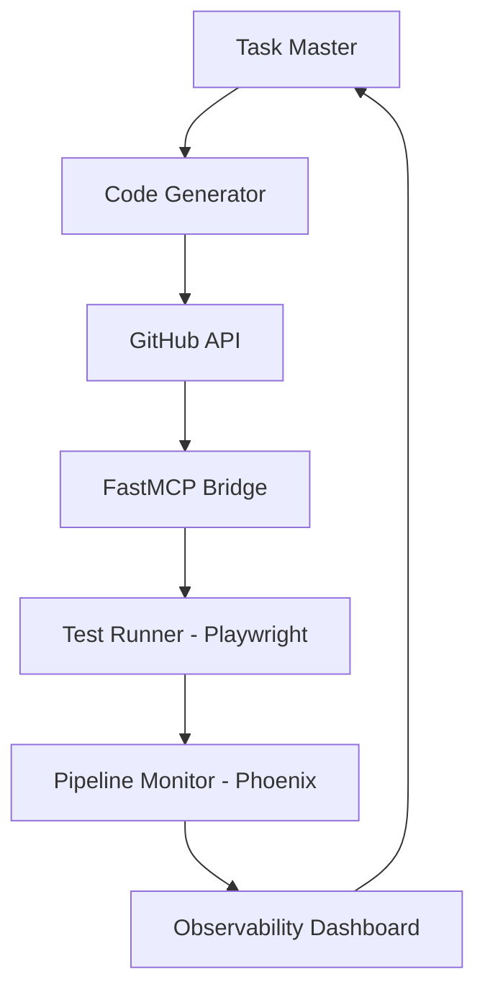

# AutoDevOps AI Orchestrator

🤖 **AI-Powered End-to-End DevOps Automation Platform**

An intelligent bot that revolutionizes the development lifecycle by automating code generation, testing, commits, and pipeline monitoring through advanced AI orchestration.

## 🎯 Project Vision

AutoDevOps AI Orchestrator combines multiple powerful tools to create a seamless, automated development workflow:

- **Task Master**: Intelligent task planning and execution
- **GitHub API**: Repository management and version control
- **FastMCP**: High-performance message communication protocol
- **Playwright**: Automated browser testing and web scraping
- **Phoenix**: Real-time observability and monitoring

## 🚀 Features

### Core Capabilities
- 🧠 **Intelligent Code Generation**: AI-driven code writing based on natural language instructions
- 🧪 **Automated Testing**: Comprehensive test suite execution with Playwright
- 📝 **Smart Commits**: Automated commit generation with meaningful messages
- 📊 **Pipeline Monitoring**: Real-time CI/CD pipeline observability
- 🔄 **End-to-End Automation**: Complete development cycle automation

### Advanced Features
- 📈 **Performance Analytics**: Code quality and pipeline performance insights
- 🛡️ **Security Scanning**: Automated vulnerability detection
- 🎨 **Code Optimization**: AI-powered code improvement suggestions
- 📱 **Multi-Platform Support**: Cross-platform deployment and testing
- 🔔 **Smart Notifications**: Intelligent alerting system

## 🏗️ Architecture



### Component Overview

1. **Task Master**: Orchestrates the entire workflow, interpreting user instructions
2. **Code Generator**: AI-powered code creation and modification
3. **GitHub Integration**: Repository management, branching, and version control
4. **FastMCP**: High-speed communication between components
5. **Playwright Testing**: Automated UI/E2E testing and validation
6. **Phoenix Monitoring**: Real-time pipeline and application observability

## 🛠️ Technology Stack

- **AI/ML**: Task Master for intelligent automation
- **Version Control**: GitHub API for repository management
- **Communication**: FastMCP for efficient inter-service messaging
- **Testing**: Playwright for comprehensive browser automation
- **Monitoring**: Phoenix for real-time observability
- **Languages**: TypeScript/Node.js, Python, Rust
- **Infrastructure**: Docker, GitHub Actions, Webhooks

## 📦 Installation

```bash
# Clone the repository
git clone https://github.com/Gzeu/autodevops-ai-orchestrator.git
cd autodevops-ai-orchestrator

# Install dependencies
npm install

# Configure environment
cp .env.example .env
# Edit .env with your API keys and configuration

# Start the orchestrator
npm run start
```

## ⚙️ Configuration

### Environment Variables

```env
# GitHub Configuration
GITHUB_TOKEN=your_github_token
GITHUB_OWNER=your_username

# AI Configuration
TASK_MASTER_API_KEY=your_task_master_key
AI_MODEL_ENDPOINT=your_ai_endpoint

# FastMCP Configuration
MCP_HOST=localhost
MCP_PORT=3000

# Playwright Configuration
PLAYWRIGHT_HEADLESS=true
TEST_TIMEOUT=30000

# Phoenix Configuration
PHOENIX_ENDPOINT=your_phoenix_endpoint
MONITORING_WEBHOOK=your_webhook_url
```

## 🎮 Usage

### Basic Workflow

1. **Initialize Project**: Set up your development environment
```bash
npm run init-project "My New Feature"
```

2. **AI-Driven Development**: Let the AI write code based on your instructions
```bash
npm run ai-develop "Create a REST API for user authentication"
```

3. **Automated Testing**: Run comprehensive tests
```bash
npm run test-suite
```

4. **Smart Deployment**: Deploy with monitoring
```bash
npm run deploy --environment=production
```

### Advanced Commands

```bash
# Monitor pipeline in real-time
npm run monitor

# Generate performance report
npm run analyze-performance

# Optimize codebase
npm run optimize-code

# Security audit
npm run security-scan
```

## 🔧 API Reference

### Core Endpoints

- `POST /orchestrate` - Start automated development workflow
- `GET /status` - Check system status and pipeline health
- `POST /test` - Execute test suite
- `GET /metrics` - Retrieve performance metrics
- `POST /deploy` - Deploy application

### Webhook Integration

```javascript
// GitHub webhook handler
app.post('/webhook/github', (req, res) => {
  // Automatic pipeline trigger on push
});

// Monitoring webhook
app.post('/webhook/monitor', (req, res) => {
  // Real-time observability updates
});
```

## 📊 Monitoring & Observability

The platform provides comprehensive monitoring through Phoenix integration:

- **Real-time Dashboards**: Live pipeline status and metrics
- **Performance Tracking**: Code execution and test performance
- **Error Monitoring**: Automatic error detection and alerting
- **Resource Usage**: CPU, memory, and network monitoring
- **Custom Metrics**: User-defined KPIs and benchmarks

## 🤝 Contributing

We welcome contributions! Please see our [Contributing Guide](CONTRIBUTING.md) for details.

### Development Setup

```bash
# Fork the repository
# Clone your fork
git clone https://github.com/your-username/autodevops-ai-orchestrator.git

# Create feature branch
git checkout -b feature/amazing-feature

# Make your changes
# Run tests
npm test

# Submit pull request
```

## 📄 License

This project is licensed under the MIT License - see the [LICENSE](LICENSE) file for details.

## 🙏 Acknowledgments

- Task Master team for intelligent automation capabilities
- GitHub for robust API integration
- FastMCP for high-performance messaging
- Playwright for comprehensive testing tools
- Phoenix for exceptional observability features

## 🔗 Links

- [Documentation](docs/)
- [API Reference](docs/api.md)
- [Examples](examples/)
- [Roadmap](ROADMAP.md)
- [Issues](https://github.com/Gzeu/autodevops-ai-orchestrator/issues)

---

**Built with ❤️ by [George Pricop](https://github.com/Gzeu)**

*Revolutionizing DevOps through AI automation*