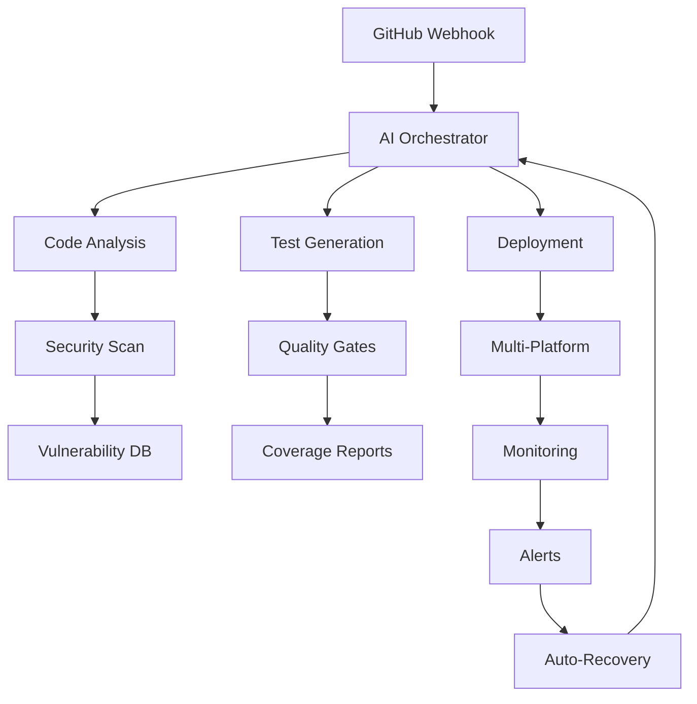

# 🤖 AutoDevOps AI Orchestrator

> **AI-powered end-to-end DevOps automation bot that writes code, runs tests, manages commits and monitors CI/CD pipelines using Task Master, GitHub API, FastMCP, Playwright and Phoenix**

[](https://autodevops-ai-orchestrator.vercel.app)
[](https://render.com/deploy?repo=https://github.com/Gzeu/autodevops-ai-orchestrator)
[](https://replit.com/github/Gzeu/autodevops-ai-orchestrator)

[](https://npmjs.com/package/@gzeu/autodevops-ai)
[](https://nodejs.org/)
[](LICENSE)
[](https://github.com/Gzeu/autodevops-ai-orchestrator/actions)
[](https://github.com/Gzeu/autodevops-ai-orchestrator/actions)
[](https://codecov.io/gh/Gzeu/autodevops-ai-orchestrator)

## 🎯 Features

### 🤖 **AI-Powered Automation**
- **Intelligent Code Writing**: AI generates and reviews code automatically
- **Smart Test Generation**: Creates comprehensive test suites
- **Automated Documentation**: Generates docs, READMEs, and API references
- **Commit Message Intelligence**: Semantic commit messages with proper formatting

### 🚀 **DevOps Orchestration**
- **CI/CD Pipeline Management**: Monitors and optimizes workflows
- **Deployment Automation**: Multi-platform deployment strategies
- **Infrastructure as Code**: Automated provisioning and scaling
- **Rollback & Recovery**: Intelligent failure detection and recovery

### 🔍 **Quality Assurance**
- **Automated Testing**: Unit, integration, and E2E test execution
- **Security Scanning**: SAST, DAST, and dependency vulnerability checks
- **Performance Monitoring**: Real-time performance metrics and optimization
- **Code Quality Gates**: Enforces coding standards and best practices

### 🌐 **Multi-Platform Support**
- **GitHub Integration**: Native GitHub API and Actions support
- **Cloud Providers**: AWS, Google Cloud, Azure (free tiers optimized)
- **Container Orchestration**: Docker, Kubernetes, and serverless platforms
- **Monitoring Stack**: Prometheus, Grafana, and custom dashboards

## 🚀 **Quick Start**

### **1-Click Deployment** 🎯

| Platform | Deploy Now | Free Tier | Features |
|----------|------------|-----------|----------|
| **Render** | [](https://render.com/deploy?repo=https://github.com/Gzeu/autodevops-ai-orchestrator) | ✅ 750h/month | Auto-deploy, SSL, Custom domains |
| **Railway** | [](https://railway.app/new/template?template=https://github.com/Gzeu/autodevops-ai-orchestrator) | ✅ $5/month credit | Instant deploy, Database included |
| **Vercel** | [](https://vercel.com/new/clone?repository-url=https://github.com/Gzeu/autodevops-ai-orchestrator) | ✅ 100GB bandwidth | Serverless, Edge functions |
| **Netlify** | [](https://app.netlify.com/start/deploy?repository=https://github.com/Gzeu/autodevops-ai-orchestrator) | ✅ 300 build minutes | JAMstack, Form handling |

### **Local Installation** 💻

```bash
# Clone the repository
git clone https://github.com/Gzeu/autodevops-ai-orchestrator.git
cd autodevops-ai-orchestrator

# Install dependencies (supports npm, yarn, pnpm, bun)
npm install
# or
bun install  # ⚡ Fastest option

# Setup environment
cp .env.example .env
# Edit .env with your API keys (all optional for basic usage)

# Start development server
npm run dev
# 🌐 Access at http://localhost:3000
```

### **Docker Setup** 🐳

```bash
# Quick start with Docker
docker run -p 3000:3000 -e NODE_ENV=production gzeu/autodevops-ai:latest

# Or build locally
docker build -t autodevops-ai .
docker run -p 3000:3000 --env-file .env autodevops-ai

# Docker Compose (includes PostgreSQL, Redis)
docker-compose up -d
```

## 🔧 **Configuration**

### **Environment Variables**

```bash
# 🤖 AI Services (Optional - has fallbacks)
OPENAI_API_KEY=sk-...                    # OpenAI GPT models
ANTHROPIC_API_KEY=sk-ant-...             # Claude models  
GROQ_API_KEY=gsk_...                     # Fast Groq inference
GEMINI_API_KEY=AI...                     # Google Gemini

# 🔗 GitHub Integration
GITHUB_TOKEN=ghp_...                     # GitHub API access
GITHUB_WEBHOOK_SECRET=your-secret        # Webhook security

# 🌐 Deployment Platforms
VERCEL_TOKEN=...                         # Vercel deployments
RENDER_API_KEY=...                       # Render.com API
NETLIFY_TOKEN=...                        # Netlify deployments

# 📊 Database (Auto-configured)
DATABASE_URL=postgresql://...            # PostgreSQL connection
REDIS_URL=redis://...                    # Redis for caching

# 🔔 Notifications (Optional)
DISCORD_WEBHOOK_URL=https://...          # Discord notifications
SLACK_BOT_TOKEN=xoxb-...                # Slack integration
TELEGRAM_BOT_TOKEN=...                   # Telegram alerts
```

### **Free Tier Optimization** 💰

The orchestrator is designed to work entirely within free tier limits:

- **AI Models**: Groq (free), Ollama (local), OpenAI (free tier)
- **Database**: Supabase (500MB), Railway (100MB), PlanetScale (5GB)
- **Hosting**: Render (750h), Vercel (100GB), Netlify (300 min)
- **Monitoring**: UptimeRobot, Better Stack, Grafana Cloud (free)

## 🔧 **Architecture**



## 📚 **Usage Examples**

### **Basic Workflow Automation**

```javascript
import { AutoDevOps } from '@gzeu/autodevops-ai';

const bot = new AutoDevOps({
  github: {
    token: process.env.GITHUB_TOKEN,
    owner: 'your-username',
    repo: 'your-repo'
  },
  ai: {
    provider: 'groq', // Free tier
    model: 'llama3-8b-8192'
  }
});

// 🚀 Automated PR workflow
await bot.createFeature({
  description: 'Add user authentication system',
  tests: true,
  documentation: true,
  deployment: 'staging'
});
```

### **CI/CD Pipeline Monitoring**

```javascript
// 🔍 Monitor all workflows
bot.on('workflow:failed', async (workflow) => {
  // AI analyzes failure and suggests fixes
  const analysis = await bot.ai.analyzeFailure(workflow.logs);
  
  // Auto-create issue with diagnostic info
  await bot.github.createIssue({
    title: `🔴 CI Failure: ${workflow.name}`,
    body: analysis.report,
    labels: ['ci-failure', 'auto-generated']
  });
  
  // Attempt automatic fix if confidence is high
  if (analysis.confidence > 0.8) {
    await bot.autoFix(analysis.solution);
  }
});
```

## 🛠️ **Contributing**

We love contributions! 🚀 Here's how to get involved:

### **Development Setup**

```bash
# Fork and clone
git clone https://github.com/YOUR_USERNAME/autodevops-ai-orchestrator.git
cd autodevops-ai-orchestrator

# Install dependencies
bun install  # or npm install

# Setup pre-commit hooks
npm run setup:hooks

# Run tests
npm test

# Start development
npm run dev
```

### **Contribution Guidelines**

1. **Fork & Branch**: Create feature branches from `main`
2. **Code Quality**: Follow ESLint, Prettier, and TypeScript rules
3. **Testing**: Add tests for new features (aim for >90% coverage)
4. **Documentation**: Update README and API docs
5. **Commit Messages**: Use [Conventional Commits](https://conventionalcommits.org/)

---

<div align="center">
  <h3>🚀 **Ready to Revolutionize Your DevOps?**</h3>
  
  [](https://autodevops-ai-orchestrator.vercel.app)
  [](https://github.com/Gzeu/autodevops-ai-orchestrator)
  
  **Built with ❤️ by [George Pricop](https://github.com/Gzeu) | Contributing to the future of automated DevOps**
</div>